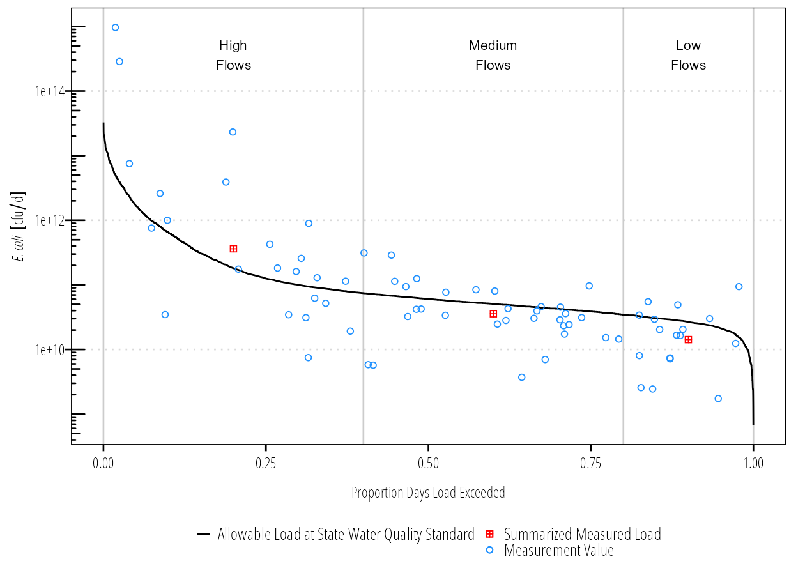
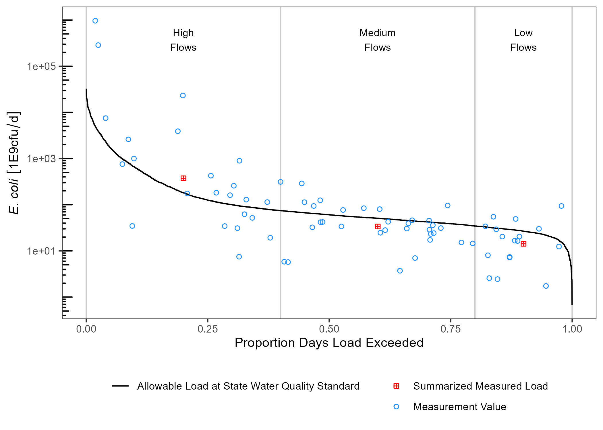

<!-- README.md is generated from README.Rmd. Please edit that file -->

# ldc

<!-- badges: start -->

[](https://www.repostatus.org/#wip)
[](https://github.com/TxWRI/ldc/actions/workflows/check-standard.yaml)
[](https://choosealicense.com/)

[](https://app.codecov.io/gh/TxWRI/ldc?branch=main)
<!-- badges: end -->

ldc provides automated and fairly opinionated functions for generating
pollutant load duration curves (LDCs) in freshwater streams. Due to the
automated nature, there isn’t much ability to adjust methodology or
customize the generated LDCs since much of the calculation is abstracted
away from the user.

ldc has three major functions:

-   `calc_ldc` takes and input dataset of matched flow and pollutant
    concentrations to generate a table with exceedance probabilities
    grouped by user specified break points.

-   `summ_ldc` uses the output from `calc_ldc` to generate a summary
    dataframe

-   `draw_ldc` uses the output from both functions to generate a LDC
    figure as a ggplot object.

## Installation

ldc is currently on Github. First install the remotes package then
install ldc from Github:

``` r
remotes::install_github("TxWRI/ldc")
```

## Example

An example using the data in the ldc package is shown below.

### Setup and format data

``` r
library(ldc)
library(dplyr)
library(units)
library(ggplot2)

## this will calculate a ldc for indicator bacteria

## ldc uses the unit package to facilitate unit conversions
## we need to make the cfu unit first, since it isn't included 
## in the units package
install_unit("cfu")

## format the data for use in ldc
tres_palacios <- as_tibble(tres_palacios) %>%
  ## flow must have units, here is is in cfs
  mutate(Flow = set_units(Flow, "ft^3/s")) %>%
  ## pollutant concentration must have units
  mutate(Indicator_Bacteria = set_units(Indicator_Bacteria, "cfu/100mL"))

tres_palacios
#> # A tibble: 7,671 x 4
#>    site_no  Date           Flow Indicator_Bacteria
#>    <chr>    <date>     [ft^3/s]        [cfu/100mL]
#>  1 08162600 2000-01-01     0.84                 NA
#>  2 08162600 2000-01-02     3                    NA
#>  3 08162600 2000-01-03     3.4                  NA
#>  4 08162600 2000-01-04     2.6                  NA
#>  5 08162600 2000-01-05     1.6                  NA
#>  6 08162600 2000-01-06     3.2                  NA
#>  7 08162600 2000-01-07    11                    NA
#>  8 08162600 2000-01-08    17                    NA
#>  9 08162600 2000-01-09    22                    NA
#> 10 08162600 2000-01-10    18                    NA
#> # ... with 7,661 more rows
```

**Calculate exceedance probability**

``` r
## specify the allowable concentration
allowable_concentration <- 126
## set the units
units(allowable_concentration) <- "cfu/100mL"

## calculate the exceedance probabilities along with
## allowable pollutant loads and measured pollutant loads
## at given probabilities
df_ldc <- calc_ldc(tres_palacios, 
                   Q = Flow, 
                   C = Indicator_Bacteria, 
                   allowable_concentration = allowable_concentration)

df_ldc
#> # A tibble: 7,671 x 9
#>    site_no  Date           Flow Indicator_Bacteria Daily_Flow_Volume Daily_Load
#>    <chr>    <date>     [ft^3/s]        [cfu/100mL]         [100mL/d]    [cfu/d]
#>  1 08162600 2000-08-18     0.22                 NA          5382466.         NA
#>  2 08162600 2000-03-07     0.42                 NA         10275617.         NA
#>  3 08162600 2000-03-06     0.6                  NA         14679453.         NA
#>  4 08162600 2000-08-22     0.75                 NA         18349317.         NA
#>  5 08162600 2000-03-08     0.78                 NA         19083289.         NA
#>  6 08162600 2000-08-17     0.78                 NA         19083289.         NA
#>  7 08162600 2000-09-11     0.8                  NA         19572604.         NA
#>  8 08162600 2000-01-01     0.84                 NA         20551235.         NA
#>  9 08162600 2000-08-21     0.93                 NA         22753153.         NA
#> 10 08162600 2000-03-05     1                    NA         24465755.         NA
#> # ... with 7,661 more rows, and 3 more variables: Allowable_Daily_Load [cfu/d],
#> #   P_Exceedance <dbl>, Flow_Category <fct>
```

**Summarize data**

``` r
df_sum <- summ_ldc(df_ldc, 
                   Q = Flow, 
                   C = Indicator_Bacteria, 
                   Exceedance = P_Exceedance,
                   groups = Flow_Category,
                   method = "geomean")
df_sum
#> # A tibble: 3 x 6
#>   Flow_Category Median_Flow Median_P Geomean_C Median_Daily_Fl~ Median_Flow_Load
#>   <fct>            [ft^3/s]    <dbl> [cfu/100mL]        [100mL/d]          [cfu/d]
#> 1 High Flows          58.9     0.200     259.       1441032996.    373699594298.
#> 2 Medium Flows        16.5     0.600      83.6       403684965.     33764600228.
#> 3 Low Flows            8.66    0.900      67.1       211995771.     14229395256.
```

**Plot LDC**

``` r
draw_ldc(df_ldc, 
         df_sum, 
         y_lab = expression(paste(italic("E. coli"))),
         label_nudge_y = log10(1000)) + 
  scale_y_log10() +
  annotation_logticks(sides = "l") +
  theme_bw() +
  theme(legend.position = "bottom",
        legend.title = element_blank(),
        legend.direction = "vertical",
        panel.grid = element_blank())
```



### Units

ldc relies on the units package to facilitate unit conversions and
tracking of units across variables. This is handy if we want to
transform units on the fly. In the above summary table, median daily
flow volume is reported in units of 100mL/day. This isn’t a logical unit
to communicate, lets change it to million. gallons/day.

``` r
df_sum %>%
  mutate(Median_Daily_Flow_Volume = set_units(Median_Daily_Flow_Volume, "1E6gallons/day")) -> df_sum
df_sum
#> # A tibble: 3 x 6
#>   Flow_Category Median_Flow Median_P Geomean_C Median_Daily_Fl~ Median_Flow_Load
#>   <fct>            [ft^3/s]    <dbl> [cfu/100mL]   [1E6gallons/d]          [cfu/d]
#> 1 High Flows          58.9     0.200     259.             38.1     373699594298.
#> 2 Medium Flows        16.5     0.600      83.6            10.7      33764600228.
#> 3 Low Flows            8.66    0.900      67.1             5.60     14229395256.
```

cfu/day is a really big number. We can convert that to billion cfu/day.

``` r
df_sum %>%
  mutate(Median_Flow_Load = set_units(Median_Flow_Load, "1E9cfu/day")) -> df_sum
df_sum
#> # A tibble: 3 x 6
#>   Flow_Category Median_Flow Median_P Geomean_C Median_Daily_Fl~ Median_Flow_Load
#>   <fct>            [ft^3/s]    <dbl> [cfu/100mL]   [1E6gallons/d]       [1E9cfu/d]
#> 1 High Flows          58.9     0.200     259.             38.1             374. 
#> 2 Medium Flows        16.5     0.600      83.6            10.7              33.8
#> 3 Low Flows            8.66    0.900      67.1             5.60             14.2
```

If we want to plot these, we also need to convert the df\_ldc variables
to matching units.

``` r
df_ldc %>%
  mutate(Daily_Load = set_units(Daily_Load, "1E9cfu/day"),
         Allowable_Daily_Load = set_units(Allowable_Daily_Load, "1E9cfu/day")) -> df_ldc
```

Updated units will carry over to the plot:

``` r
draw_ldc(df_ldc, 
         df_sum, 
         y_lab = expression(paste(italic("E. coli"))),
         label_nudge_y = log10(1000)) + 
  scale_y_log10() +
  annotation_logticks(sides = "l") +
  theme_bw() +
  theme(legend.position = "bottom",
        legend.title = element_blank(),
        legend.direction = "vertical",
        panel.grid = element_blank())
```


